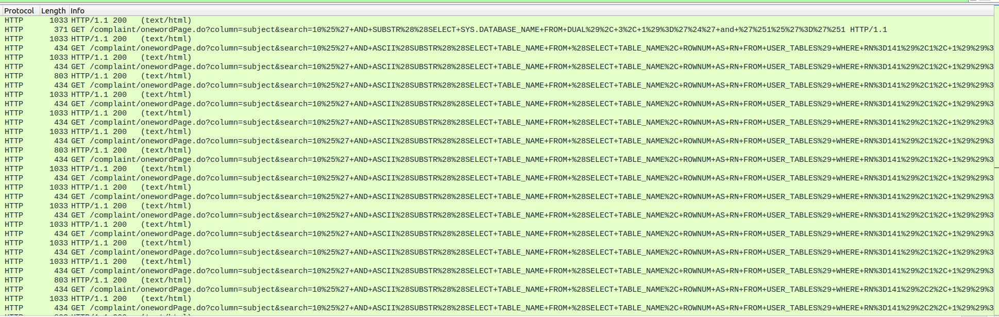

Here are the challenges I solved for CDDC 2025 qualifiers.

## My Missing Hamster

| Category | OSINT |
|-|-|
| Points | 100 |

This challenge was pretty simple, we are given an Instagram page <https://www.instagram.com/kayatoast_8l/>
The second post has the caption `1894661267354521816`. I recognised this as
a Twitter snowflake, you can just replace this snowflake in the URL of a tweet
without knowing the username of the account, so going to <https://x.com/a/status/1894661267354521816>
redirects us to <https://x.com/kayatoast_8l/status/1894661267354521816>, where the tweet says
`flag{G0t_c4ught_b7_m7_0wn3r}`. Replacing `flag` with `CDDC2025` gives us the real flag.

## Someone Stole my Table

| Category | Network Analysis |
|-|-|
| Points | 100 |

We are given a pcap file, there are a lot of HTTP requests resembling SQL injection.

Running `strings Someone\ stole\ my\ table.pcap | grep "ASCII" > temp`, I extracted all the sqli attempts and
after cleaning it up a bit, we get:

```
 ASCII(SUBSTR((SELECT TABLE_NAME FROM (SELECT TABLE_NAME, ROWNUM AS RN FROM USER_TABLES) WHERE RN=141),1, 1))=80
 ASCII(SUBSTR((SELECT TABLE_NAME FROM (SELECT TABLE_NAME, ROWNUM AS RN FROM USER_TABLES) WHERE RN=141),1, 1))<80
 ASCII(SUBSTR((SELECT TABLE_NAME FROM (SELECT TABLE_NAME, ROWNUM AS RN FROM USER_TABLES) WHERE RN=141),1, 1))=56
 ASCII(SUBSTR((SELECT TABLE_NAME FROM (SELECT TABLE_NAME, ROWNUM AS RN FROM USER_TABLES) WHERE RN=141),1, 1))<56
 ASCII(SUBSTR((SELECT TABLE_NAME FROM (SELECT TABLE_NAME, ROWNUM AS RN FROM USER_TABLES) WHERE RN=141),1, 1))=68
 ASCII(SUBSTR((SELECT TABLE_NAME FROM (SELECT TABLE_NAME, ROWNUM AS RN FROM USER_TABLES) WHERE RN=141),1, 1))<68
 ASCII(SUBSTR((SELECT TABLE_NAME FROM (SELECT TABLE_NAME, ROWNUM AS RN FROM USER_TABLES) WHERE RN=141),1, 1))=62
 ASCII(SUBSTR((SELECT TABLE_NAME FROM (SELECT TABLE_NAME, ROWNUM AS RN FROM USER_TABLES) WHERE RN=141),1, 1))<62
 ASCII(SUBSTR((SELECT TABLE_NAME FROM (SELECT TABLE_NAME, ROWNUM AS RN FROM USER_TABLES) WHERE RN=141),1, 1))=65
 ASCII(SUBSTR((SELECT TABLE_NAME FROM (SELECT TABLE_NAME, ROWNUM AS RN FROM USER_TABLES) WHERE RN=141),1, 1))<65
 ASCII(SUBSTR((SELECT TABLE_NAME FROM (SELECT TABLE_NAME, ROWNUM AS RN FROM USER_TABLES) WHERE RN=141),1, 1))=66
 ASCII(SUBSTR((SELECT TABLE_NAME FROM (SELECT TABLE_NAME, ROWNUM AS RN FROM USER_TABLES) WHERE RN=141),1, 1))<66
 ASCII(SUBSTR((SELECT TABLE_NAME FROM (SELECT TABLE_NAME, ROWNUM AS RN FROM USER_TABLES) WHERE RN=141),1, 1))=67
 ASCII(SUBSTR((SELECT TABLE_NAME FROM (SELECT TABLE_NAME, ROWNUM AS RN FROM USER_TABLES) WHERE RN=141),2, 1))=80
 ASCII(SUBSTR((SELECT TABLE_NAME FROM (SELECT TABLE_NAME, ROWNUM AS RN FROM USER_TABLES) WHERE RN=141),2, 1))<80
...
```

The attacker is trying to find the value of `TABLE_NAME` for various rows in `USER_TABLES` by guessing the ASCII value of each character.
I assume the last request for each character was a successful guess, so I just singled them out and decoded the string in python.

```py
>>> ''.join(map(chr, map(int, "67 79 78 71 82 65 84 85 76 65 84 73 79 78 83 126 84 72 69 95 70 76 65 71 95 73 83 126 79 80 69 78 95 89 79 85 82 95 84 72 73 82 68 95 69 89 69 126".split(" "))))
'CONGRATULATIONS~THE_FLAG_IS~OPEN_YOUR_THIRD_EYE~'
```

## ReactUpgrade

| Category | Web |
|-|-|
| Points | 100 |

We are given a simple react app with two buttons.
One button gives us 100 minerals, and another button increases our upgrade level at the cost of some minerals.
Every time you upgrade the cost increases and the probability of an upgrade occurring decreases,
and if your upgrade fails, it will decrease your level.

Presumably, we have to reach a certain level to get the flag,
but reaching that level normally would be statistically impossible.

As this is a compiled react app, the js file is too big to dig through,
I fired up react dev tools to find the event listener for the two buttons.


It looks like once we hit level 30, it will run some function to decrypt the encrypted flag
and display it on screen, so we can just change this value to 1 and get the flag.

```JavaScript
n + 1 >= 1) {
  const e = s("x4MBmI6OADwRz5JiFJgmDQOfhePH8fXYnhIT0YJcc8Rj31CMpXk9tHWv2ZpgN51PngAM7IrMvtBuiWHkwU6xng==");
  alert(e)
}
```


## VVIP

| Category | Web |
|-|-|
| Points | 350 |

In this challenge we have a website where we are assigned a ticket upon logging in,
and a page to check the ticket if we are a "VVIP".
The js on the page showed the ticket checking logic.

```JavaScript
(async () => {
    const response = await fetch("/static/wasm/wasm_ticket.wasm");
    const bytes = await response.arrayBuffer();
    const { instance } = await WebAssembly.instantiate(bytes, {});

    document.getElementById("submit").addEventListener("click", () => {
        let userticket = document.getElementById("ticket").value;

        let userticket_bytes = new TextEncoder().encode(userticket + "\0");

        let input_ptr = 1024; 
        let memory = new Uint8Array(instance.exports.memory.buffer);

        memory.set(userticket_bytes, input_ptr);

        let is_vvip = instance.exports.check_ticket(input_ptr);
        
        let endpoint = is_vvip ? "/check_vip" : "/check_ticket";

        fetch(endpoint, {
            method: "POST",
            headers: { "Content-Type": "application/json" },
            body: JSON.stringify({ "ticket": userticket }),
        })
        .then(response => response.json())
        .then(data => {
            document.getElementById("result").innerText = data.status;
        })
        .catch(error => console.error("Error:", error));
    });
})();
```

The code loads a WebAssembly file and uses the `check_ticket` function.
It uses that to determine whether to send your ticket to the
`/check_vip` endpoint or the `/check_ticket` endpoint.
We can assume this `check_ticket` function is also being used at the `/check_vip` endpoint,
so we need to figure out how to get `check_ticket` to return something truthy.

I cloned and built [wabt](https://github.com/WebAssembly/wabt) so that
I could use [wasm-decompile](https://github.com/WebAssembly/wabt/blob/main/docs/decompiler.md).
The decompiled code was really messy but basically it
calls an encrypt_ticket function and checks if the resulting bytes are the same as
`"AnZ2cQZ3N0VHA3N0C3I5OTY7fA0EdQR2SDIGdnFxd3c="`.
Since the encrypt_ticket function was also being exported,
I downloaded the wasm file and loaded the function into a JavaScript file and played around with it.

I noticed that every group of 3 input bytes gets encrypted to 4 output bytes,
and that the 1st input byte affects all 4 output bytes, but the 2nd input byte only affects
the 2nd-4th output byte, and the 3rd input byte only affects the 3rd and 4th output byte.
With this idea, I can find the correct input that will give us the encrypted output
we want through brute force.

```JavaScript
const readAsBinary = file => {
  if (typeof process === 'object' && typeof require === 'function') {
    const binary = require('fs').readFileSync(file);
    return !binary.buffer ? new Uint8Array(binary) : binary;
  } else
    return typeof readbuffer === 'function'
      ? new Uint8Array(readbuffer(file))
      : read(file, 'binary');
};

const mod = new WebAssembly.Module(readAsBinary("wasm_ticket.wasm"))
function test(userticket, check_num) {
  const instance = new WebAssembly.Instance(mod, {});
  let userticket_bytes = new TextEncoder().encode(userticket);

  let input_ptr = 1024;
  let memory = new Uint8Array(instance.exports.memory.buffer);
  let output_ptr = 2048;

  memory.set(userticket_bytes, input_ptr);
  instance.exports.encrypt_ticket(input_ptr, output_ptr, 64)
  memory = new Uint8Array(instance.exports.memory.buffer);

  let encrypted_bytes = memory.slice(output_ptr, output_ptr + 64);
  const encrypted_str = new TextDecoder().decode(encrypted_bytes);
  const result = Array.from(Buffer.from(encrypted_str)).slice(0, flag.length)

  for (let i = 0; i < check_num; i++) {
    if (result[i] != flag[i]) return false
  }

  return true
}

flag = [65, 110, 90, 50, 99, 81, 90, 51, 78, 48, 86, 72, 65, 51, 78, 48, 67, 51, 49, 53, 79, 84, 89, 55, 102, 65, 48, 69, 100, 81, 82, 50, 83, 68, 49, 71, 100, 110, 70, 120, 100, 51, 99, 61]

// Assume this set of valid characters
const valid = []
for (let i = 48; i < 58; i++) {
  valid.push(String.fromCharCode(i))
}
for (let i = 97; i < 103; i++) {
  valid.push(String.fromCharCode(i))
}
let a = [""]

while (a[0].length < 31) {
  const temp = []
  for (let i = 0; i < valid.length; i++) {
    a.forEach(initial => {
      if (test(initial + valid[i], Math.floor((initial.length + 1) / 3) * 4 + ((initial.length + 1) % 3))) temp.push(initial + valid[i])
    })
  }

  console.log(JSON.stringify(temp))
  a = temp
}

// Formula breaks for the last character, so just manually do it
const temp = []
for (let i = 0; i < valid.length; i++) {
  a.forEach(initial => {
    if (test(initial + valid[i], 44)) temp.push(initial + valid[i])
  })
}

const solution = temp[0]
console.log(solution)
```

I wrote some code to automate this but my code
could not find any possible input around the 15th input byte.
So I expanded the range of valid input bytes from just the hexadecimal
bytes to all ASCII bytes, and my code was able to find a valid ticket!
The ticket I got was `d968d4c01e44b/2ece2bd4f54h086965` but it wasn't
passing the check_ticket function.

To sanity check, I looked back at the wasm and the value in memory my encrypted ticket was being compared to.
Chrome dev tools was really useful as it also could decompile the wasm
and comes with a debugger, that displays the value of the stack, variables, and memory at breakpoints.
Checking the memory of my encrypted ticket and the value it was being compared to, I
didn't see any difference.

<p align="center">
  
  <i>My encrypted ticket in memory</i>
</p>
<p align="center">
  
  <i>Value in memory it was being compared to</i>
</p>

Notice any difference? Byte 19 in the second image is `\x6C` while in the first image it is `\x31`.
The same thing occurs at byte 35. The reason I hadn't noticed this was cause I was looking
at the ASCII representation of the bytes, where `\x6C` corresponds to `l` and `\x31` corresponds to `1`
and the font made the two characters look the same.

Fixing these two values in my code,
I was able to produce the correct ticket `d968d4c01e44b32ece2bd4f54d086965`,
submitting this to the website gave us the flag `CDDC2025{W4SM_1s_0nLy_F0r_VV1P}`
