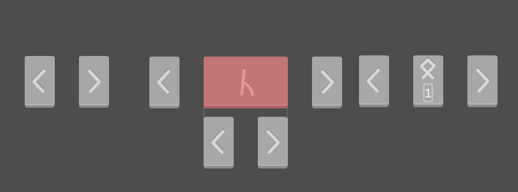

Targeted level of achievement: **Apollo**

Knights of the Lambda Calculus (KOTLC) is an educational game to teach players
the basics of [Lambda Calculus](https://en.wikipedia.org/wiki/Lambda_calculus).
Our game lets players have a sense of how such a simple system can be used to
compute anything. The game features a intuitive layout for visualising and
constructing Lambda expressions, along with a carefully curated set of levels
that guide players through the Lambda calculus.

Our target audience is to anyone that enjoys puzzle games, and are interested in
learning more about Lambda Calculus, they do not need to be experienced in
programming at all.

The game will be distributed as a binary and also be available on the web. We
will support Windows and Linux, and the web version will be published on the
itch.io platform.

Try out our game
[here!](https://mug1wara26.itch.io/knights-of-the-lambda-calculus)

## What is the Lambda Calculus?

Before we explain the game, it would be good to have a brief understanding of
Lambda Calculus, The Lambda calculus works off function abstractions and
applications, if you have done any programming you should be able to understand
it.

A Lambda expression is constructed from Lambda terms, where a term is defined as
one of the following:

1. $x$, a variable representing a Lambda parameter
2. $(\lambda x. M)$ a Lambda, who's parameter is represented by the bound
   variable $x$, returning $M$ (another Lambda term), upon application on this
   Lambda. Examples of Lambdas include $(\lambda x.x)$ (the identity) or
   $(\lambda x. (\lambda y. x))$ (the
   [K combinator](https://en.wikipedia.org/wiki/SKI_combinator_calculus)).
3. $(M\ N)$, an application of $N$ on $M$, replacing the bound variables in $M$
   with $N$

Applications in Lambda Calculus are like function applications in conventional
programming language. For example, the function $\lambda x.x$ is like a pure
unary function that just returns its input argument

```Python
def foo(x):
  return x
```

An application on this function replaces all identifiers `x` with the value it
was applied with, this is known as beta reduction.

Applications in the Lambda Calculus are assumed to be left associative, meaning
$M\ N\ P$ is assumed to represent $((M\ N)\ P)$. Parenthesis can be used to
remove ambiguity, and must be used for expressions like $M\ (N\ P)$

Lambda expressions can be easily written in other programming languages, for
example, the Lambda expression for the
[S combinator](https://en.wikipedia.org/wiki/SKI_combinator_calculus) is
$\lambda x. \lambda y. \lambda z. x(z)(y(z))$.

Python:

```py
S = lambda x: lambda y: lambda z: x(z)(y(z))
```

JavaScript:

```js
const S = (x) => (y) => (z) => x(z)(y(z));
```

The S combinator can be thought of as a three argument
[curried](https://en.wikipedia.org/wiki/Currying) function that takes in $x,y,z$
and takes the application of $z$ on $y$, (represented as $y(z)$), and applies it
on the application of $z$ on $x$, (represented as $x(z)$).

Believe it or not, the Lambda Calculus can be used to compute any computable
function, as it can be used to simulate a Turing machine. In simple words, the
Lambda Calculus can theoretically run Minecraft! (However the resulting Lambda
expression would likely be terabytes in size)

## Evaluating Lambda expressions

Evaluating a Lambda expression is simple. We just keep performing applications
until there are no more applications left to perform. The resulting Lambda
expression is said to be in
[beta normal form](https://en.wikipedia.org/wiki/Beta_normal_form)

For example, given the Lambda expression:
$$(\lambda a. \lambda b. a(b)(\lambda x. \lambda y. y))(\lambda x. \lambda y. x)(\lambda x. \lambda y. y)$$
It eventually beta reduces to $\lambda x. \lambda y. y$. (This expression can be
seen as performing a logical AND on two booleans, true and false, using
[Church Encoding](https://en.wikipedia.org/wiki/Church_encoding))

## The game

I first started conceptualizing an idea for a Lambda Calculus game when I was
studying it and found it really fun to derive operations on
[Church Encodings](https://en.wikipedia.org/wiki/Church_encoding) like Church
Booleans and Church Numerals. I wanted others to experience the same fun I had,
but in a more approachable way.

We ultimately decided on a puzzle game where users are tasked to come up with
Lambda expressions that operate on some data type encoded in the Lambda
calculus. Each chapter will be dedicated to a specific encoding, earlier
chapters will use the aforementioned Church Encodings, but later chapters could
introduce custom encodings for more complex mathematical structures, like the
rationals or reals, or even sets and groups.

The layout of a level is inspired by other games like
[NandGame](https://nandgame.com/),
[Alligator Eggs](https://worrydream.com/AlligatorEggs/), and a
[certain CS1101S exercise](https://aloysius.dev/modrevs/AY2425S1/cs1101s.html#functional-expressionism).

## Implemented features

1. A **moveable canvas** that houses the expressions that users will create
2. A **click and drop snapping system** to create Lambda expressions and modify
   them. Visual indicators appear for where the user can click on.
3. A **title screen** for users to access tutorial, levels, and settings.
4. A **level selection screen**, displaying chapters and their accompanying
   levels. Each chapter comes with a theme and a set of levels, each level
   building on the previous one.
5. A **tutorial** explaining the UI of the game, and gives a brief introduction
   to Lambda Calculus
6. A **step by step evaluator**, that performs an application on the Lambda
   expression for each step, until the expression is in beta normal form.
7. An **animation system**, that animates each step of the evaluation. Players
   can visually see which Lambdas are being applied to, and which Variable is
   being substituted.
8. Multiple **UX enhancements**, such as Lambda elements being colored by their
   depth, using RYGOBIV rainbow colors. Variables share the same color with the
   Lambda they are associated with.
9. A **compiler** that transforms strings representing Lambda expressions into
   the elements in the game. The compiler tokenizes and parses the string into
   an
   [abstract syntax tree](https://en.wikipedia.org/wiki/Abstract_syntax_tree),
   that is then optimized and converted into our game elements.
10. Partial implementations of a **level loader**, that takes in a JSON file
    that represents a level, and builds the level for the user to play.

## Implementation details

Our whole game is built using [Godot](https://godotengine.org/). It is a free
and open-source web engine that is also cross platform, allowing us to support
Windows, Linux and the web. Our app is fully programmed with
[GDScript](https://docs.godotengine.org/en/4.4/tutorials/scripting/gdscript/gdscript_basics.html),
a high-level, Object Oriented, and interpreted language with a similar syntax to
Python, making it easy to develop with. An explanation of how Godot works is out
of scope for this readme, you can read about an introduction to Godot on
[this page](https://docs.godotengine.org/en/stable/getting_started/introduction/index.html)

### UI

We represent Lambda Calculus with 3 types of elements: Parenthesis, Lambdas, and
Variables. Parenthesis can contain an arbitary list of nodes, a Lambda has a
Parenthesis representing its body, and Variables are leaf nodes. These nodes
form a (non binary) tree with a Parenthesis as the root - this is a lambda
expression. Using these nodes, we can represent any lambda expression in the
game UI.



To evaluate expressions, the user has access to a set of buttons in the top
right corner. They can evaluate the expression completely or step by step. They
can also pause the animated evaluation whenever desired. We hope that this
flexible system can facilitate learning and understanding of the lambda calculus
evaluation process.


### The evaluator

When evaluating Lambda expressions, there are many different strategies. The
strategy we implemented is
[call by name](https://en.wikipedia.org/wiki/Evaluation_strategy#Call_by_name).
This strategy only evaluates expressions when they are needed during
application, so arguments passed into a Lambda are not evaluated at first.

Godot's scene tree system comes in handy here. All the different elements of a
Lambda expression are laid out in the scene tree, forming a kind of abstract
syntax tree that we can recursively parse during evaluation. At each step of the
evaluation, we modify the tree, replacing variables and removing Lambdas.

Our application logic is contained in the Parenthesis element. The function
checks if the first element of the Parenthesis is a Parenthesis, if so, it calls
the apply function on that subexpression. If it is a Lambda, we call the
substitute function on the Lambda, which replaces all bound variables in its
subtree with the argument. Note that the first element can never be a Variable
as that would make the Lambda expression invalid.

Here is some pseudocode for the application logic.

```Python
def apply():
  var first = expressions[0]
  if first is Parens:
    first.apply()
  elif expressions.size >= 2:
    if first is Lambda:
      first.substitute(expressions[1])
    else:
      Throw Error
```

### Animations

The animations make extensive use of Godot's Tweens. These allow us to vary
properties or call functions over time, with a lot of flexibility. These,
together with some shader tricks, allow for a system that can deal with the
dynamic nature of lambda expressions and animate the application process
smoothly.


### Level System

The level system is partially implemented now. Each level is represented as a
JSON file with the following structure:

```JSON
{
  "example_input": [<List of Lambda expressions>],
  "example_output": "<Lambda expression>",
  "custom_expressions": {
    "<name>": "<Lambda expression as string>"
  },
  "messages": [<List of messages to be displayed during level>]
}
```

`example_input` is a list of Lambda expressions written using
[de Brujin Indexing](https://en.wikipedia.org/wiki/De_Bruijn_index).
`example_output` is the same except it is only a single string. These strings
are compiled into Lambda expressions that can be visualised in our game. They
are used to show the player an example of what inputs would look like in our
test cases and the corresponding expected outputs.

We also support custom expressions that can be used in the Lambda expressions.
These can be thought of as named functions that can be referenced by
`example_input` and `example_output`. The reason for this is to reduce the large
size of complex Lambda expressions. In the game these custom expressions will be
visualised as a single element.

Lastly, the JSON file can specify a list of messages to be displayed to the user
at the start of the level. This is used to explain to the user what the level is
about, and what they are supposed to construct to solve the level. These
messages support
[BBCode](https://docs.godotengine.org/en/latest/tutorials/ui/bbcode_in_richtextlabel.html),
a markup language that can be used to format messages, e.g. bolding, lists, and
tables.

### Lambda Compiler

As mentioned above, we have written a compiler that translates Lambda
expressions from string to elements on a canvas in our game.

The compiler first tokenizes and parses the string into an abstract syntax tree.
We use a recursive descent parser based on the following grammar:

```
<expr> ::= { <atom> }

<atom> ::= "/" <expr>
       | "(" <expr> ")"
       | <int>
       | "[" <name> "]"

<int>  ::= digit { digit }

<name> ::= identifier
```

We then optimize the AST, and translate it into our game, this process was
trivial as the AST nodes have a direct mapping to the elements in our game.

## Software Engineering Practices

Our code is hosted on GitHub. We make use of branches to implement different
features, once these features are done, we open a PR to have the other team
member review it before merging into master.

We also make use of the issues tracker on GitHub to track bugs and features, and
have them assigned to one of us.

Lastly, we have implemented a GitHub Actions workflow that automatically builds
our game and publishes it to itch.io. To activate the actions, we just have to
create a new tag with a label using semantic versioning:
`git tag -a v<MAJOR>.<MINOR>.<PATCH>`. The workflow detects a new tag and builds
the project from the master branch.

For milestone 3, we plan to implement unit tests and E2E testing, allowing us to
lint and test every PR before allowing merge using GitHub Actions.

## Planned features

1. Testing answers - A second nonvisual evaluator for quick testing of multiple
   inputs to verify answers. This will be used in the background when the user
   submits their solution to thoroughly check that their solution is correct.
   Think of this as "private" test cases, while the level itself will have a
   "public" test case that is run with our step by step evaluator.
2. Playground - Allows users to play around with their own Lambda expressions,
   as well as create custom expressions.
3. Custom Levels - We will design our own level file format. Users can then
   create their own levels with a built in level editor and export it to a file.
   They can then share this file with other people.
4. Level design - Plan the design of chapters and levels, this involves writing
   out a custom level.json file for each level we have planned.
5. More SFX and VFX to give the game some visual flair, like picking up elements
   and dropping them down should have some sound effects and animation

## Planned levels

### Chapter 1: Church Booleans

1. And Gate
2. Or Gate
3. Not Gate
4. Nand Gate
5. Xor Gate
6. Half adder (Maybe optional)

### Chapter 2: Church Numerals Part 1

1. Zero
2. Succ
3. Five (Using repeated applications on succ)
4. Plus
5. Mult

### Chapter 3: Pairs and lists

1. Pair
2. Fst and Snd
3. Empty list and is empty
4. Cons
5. Access

### Chapter 4: Church Numeral Part 2

1. Pred (Using the pair definition of pred, can be split up into multiple
   levels)
2. Minus
3. Less than or equals
4. Equals
5. Division (Doesn't need y combinator)
6. Remainder

### Chapter 5: Recursion

1. Factorial with Y combinator (We wont actually make them create the Y
   combinator, we will just explain the Y combinator to them and make them
   implement factorial)
2. Remainder with Y combinator
3. GCD
4. Fold left
5. Concat
6. Map
7. Filter

### Chapter 6: Rationals

1. Rationals ($R = \lambda a. \lambda b. pair\ a\ b$, where a represents the
   numerator and b represents the denominator)
2. Simplify rational using GCD
3. Convert to mixed fraction
4. Multiplication
5. Division

### Chapter 7: Sets

A set will be defined as a function that returns true if its argument is in the
set, our set will work over the church numerals

1. Empty and single ton set
2. Insert
3. Member
4. Union
5. Intersection
6. Is equal
7. Difference
