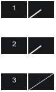
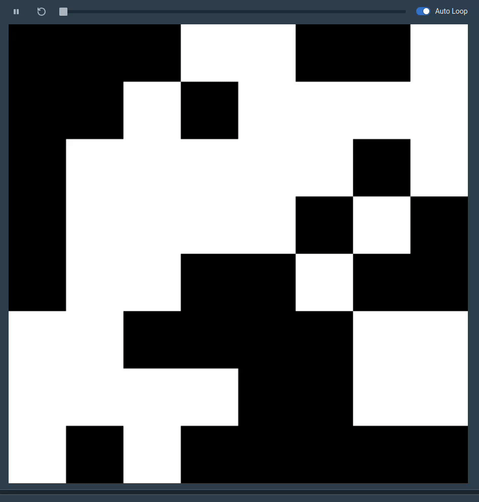

CS1101S is a module to introduce students to programming, the module uses Source,
a subset of JavaScript based off the
[Structure and Interpretation of Computer Programs](https://sourceacademy.org/sicpjs/) textbook.
The language is split into 4 main chapters, and with each chapter,
students gets access to more powerful programming constructs.

Although I was already experienced in programming before taking this module,
I found that it helped reinforce concepts such as recursion and also introduced
many fundamental programming language concepts that I was not aware of,
such as [Lambda Calculus](https://en.wikipedia.org/wiki/Lambda_calculus)
and [Meta Circular Evaluator](https://en.wikipedia.org/wiki/Meta-circular_evaluator).
It is clear that this module is heavily inspired by core functional programming concepts,
and it does a great job at introducing these concepts to beginner programmers.

## Module Components

This module uses [Source Academy](https://github.com/source-academy),
a web platform that provides a gamified experience for students.
There are 3 types of assignments to do on the platform:

1. *Paths*, akin to lecture reviews
2. *Missions*, more structured programming exercises
3. *Quests*, much harder optional exercises

Doing these exercises gives you experience points, and
every 1000 XP nets you a level and you need 24 levels to get the full grade for this component.

Other CA components include tutorial/recitation attendance and mastery checks.
For assessments there were 2 reading assessments, as well as midterms and finals, and an online practical test, which were basically 6 leetcode easy questions.

| Component              | Weightage |
|------------------------|-----------|
| Source Academy         | 14%       |
| Mastery Checks         | 6%        |
| Tutorial Participation | 2%        |
| Tutorial Attendance    | 3%        |
| Reading Assessment 1   | 5%        |
| Reading Assessment 2   | 8%        |
| Practical Test         | 12%       |
| Midterms               | 15%       |
| Finals                 | 30%       |

## Source 1

The module starts off with Source 1, which is a very restrictive language[^source_specs].
[^source_specs]: The full specification of Source 1 can be found [here](https://docs.sourceacademy.org/source_1.pdf).
It only has constant declarations, functions, lambdas, ternaries, and basic math/boolean operators.

As there are no for loops, this part of the module forces you to think recursively,
at first I thought this was a dumb way to introduce programming,
but I grew to appreciate how this module makes you solve problems
with the restricted tools at hand, leading to cleaner and more
elegant code, that often represented the mathematical nature of the underlying problem.
For example, [pascals identity](https://en.wikipedia.org/wiki/Pascal%27s_rule) says that
$$
  \begin{pmatrix} n \\ r \end{pmatrix} = \begin{pmatrix} n-1 \\ r-1 \end{pmatrix} + \begin{pmatrix} n - 1\\ r \end{pmatrix}
.$$
and can be implemented recursively like so:

```js
function choose(n, r) {
    return (n < r) 
      ? 0
      : (n === r || r === 0) 
        ? 1
        : choose(n - 1, r - 1) + choose(n - 1, r); 
}
```

## Source 2

Source 2 introduces pairs and lists officially. A pair is just an ordered pair with a head and a tail,
and a list is defined recursively as either `null`,
or a pair who's tail is a list.

```js
const xs = list(1, 2, 3) // Internally represented as [1, [2, [3, null]]]
const ys = pair(1, pair(2, pair(3, null)));
display(equal(xs, ys)); // Should display true
```

As a list is itself a recursive data structure, it further reinforces
recursive thinking. The lectures goes through how one can exploit the recursive structure to easily implement some list functions,
such as map, filter, accumulate/fold, and [more](https://docs.sourceacademy.org/LISTS/).
Another exercise had us implement merge and quick sort on these lists.

While studying other programming languages, I realised that the way this module
introduces lists is heavily inspired by [cons lists](https://en.wikipedia.org/wiki/Cons),
which is a construct in pure functional programming languages.
The module also uses the same box and arrow notation to visualise these lists.
<p align="center">
  
  <i>The list [1, [2, [3, null]]]</i>
</p>

## Source 3

Source 3 introduces many things common in other programming languages.
Variable declaration and assignment using `let`, iteration using `while` or `for` loops,
and array literals and access. This chapter introduces two important concepts, **Streams** and **Memoization**.

### Streams
A stream is defined recursively as either null (the empty stream), or a pair, with it's head containing
some data item, and it's tail containing a nullary function (a function with no arguments),
that returns a stream. The important idea is that a stream is **lazily evaluated**, the items on
the stream are only computed when we need them.

```JavaScript
// A stream containing the items 1, 2, 3. 
const s1 = pair(1, () => pair(2, () => pair(3, () => null)));
// We can use the stream helper function to construct a stream 
const s2 = stream(1,2,3);
```

The concept of streams and lazy evaluation is explored further in CS2030S,
this module just gives us a brief introduction into stream processing and infinite streams.

### Memoization
A function can be memoized by caching the result of its computation.
Suppose we had a nullary function and we wanted to cache it's result,
we can simply just assign its result to a variable, and use that variable in the future.
We can also create a helper function that takes in a nullary function, and returns a memoized version.

```JavaScript
function memo(f) {
  let result; 
  let is_run = false;
  function memoFun() {
    if (!is_run) {
      result = f();
      is_run = true;
    }
    return result;
  }

  return memoFun;
}
```

What if we had a unary function and needed to memoize it? We can use arrays to achieve this,
so long as long as the inputs to the function are numbers that can index an array[^array_index]. Let's use the Fibonacci function as an example.

[^array_index]: In JavaScript, array indexes are unsigned 32 bit integers, hence the largest number that can index an array is $2^{32}-1$

```JavaScript
// Let fib(0) = 1 and fib(1) = 1
const memoTable = [1, 1];

function memoFib(n) {
  if (memoTable[n] == undefined) {
    memoTable[n] = memoTable[n-1] + memoTable[n-2];
  }

  return memoTable[n];
}
```

In general, we can memoize any function with integer arguments using arrays,
and functions that take in n arguments would require n-dimensional arrays.
Source does not have hash tables or objects, but in theory you can construct a hash function
so that you can memoize functions with any type of arguments.

## Source 4
This chapter introduces three new functions.
`tokenize`, to convert a program string into [lexical tokens](https://en.wikipedia.org/wiki/Lexical_analysis),
`parse`, to convert a program string into a [parse tree](https://en.wikipedia.org/wiki/Parse_tree),
and `apply_in_underlying_javascript`, which takes a function, and a list of arguments,
and applies the arguments to the function.
These functions are used to create a Meta Circular Evaluator (MCE).

### Meta Circular Evaluator
This is the topic where most students get lost, and to be honest,
I did not pay any attention to this topic either. The final exam only had 2 or 3
MCQ questions on this topic, so I did not bother studying for it. However I believe the
underlying ideas behind this topic is still really interesting. As is many other things in this module,
the Meta Circular Evaluator originated from [Lisp](https://www-formal.stanford.edu/jmc/recursive.pdf).

The core idea behind the MCE is the eval-apply loop. `eval` takes in an expression and recursively evaluates subexpressions,
returning the expression itself if it is a literal. If `eval` encounters a function application, it
uses `apply` to run the function. `apply` takes in a function and its arguments,
and runs evaluate on the function body, with the arguments in its added to the current context.

The full MCE is described in [the textbook](https://sourceacademy.nus.edu.sg/sicpjs/4.1.1).

## Fun stuff

### Brainfuck interpreter

Although Source 1 is a very restrictive language, it is still turing complete,
and I made a simple [Brainfuck](https://en.wikipedia.org/wiki/Brainfuck) interpreter in it.
Brainfuck requires an infinite length tape, and is best represented with a list.
Although there are no lists in Source 1, they can be implemented using lambdas.
I achieved this by first defining a pair as:

```js
const pair = (x, y) => b => b ? x : y;
const first = p => p(true);
const second = p => p(false);
```

It works by taking in two arguments which form the pair, then returning a function
that takes in a boolean, if the boolean is `true` it will return the first element,
else it returns the second. With this you can define a linked list as a string of pairs
and perform operations on the list through recursion. I can then define the tape
as a pair of two lists, to make moving forward and backwards through the list easier.

```js
const forward_tape = pair(0, undefined);
const backward_tape = pair(0, undefined);
const tape = pair(forward_tape, backward_tape);

const curr_byte = tape => {
  return head(head(tape));
};

const move_right = tape => {
  const forward_tape = head(tape);
  const backward_tape = tail(tape);

  // If reach end of tape, make more tape :)
  if (is_undefined(tail(forward_tape))) {
    return pair(
      pair(0, undefined),
      pair(0, backward_tape)
    );
  }
  else {
    return pair(
      tail(forward_tape),
      pair(head(tail(forward_tape)), backward_tape)
    );
  }
};
```

`move_left` can be similarly defined. For the `,` instruction, which prints the current byte,
I defined a long ascii string of 256 characters, where the *ith* character represents the *i-1th* byte

```js
const ascii = '\x00\x01\x02\x03\x04\x05\x06\x07\x08\t\n\x0b\x0c\r\x0e\x0f\x10\x11\x12\x13\x14\x15\x16\x17\x18\x19\x1a\x1b\x1c\x1d\x1e\x1f !"#$%&\'()*+,-./0123456789:;<=>?@ABCDEFGHIJKLMNOPQRSTUVWXYZ[\\]^_`abcdefghijklmnopqrstuvwxyz{|}~\x7f\x80\x81\x82\x83\x84\x85\x86\x87\x88\x89\x8a\x8b\x8c\x8d\x8e\x8f\x90\x91\x92\x93\x94\x95\x96\x97\x98\x99\x9a\x9b\x9c\x9d\x9e\x9f\xa0¡¢£¤¥¦§¨©ª«¬\xad®¯°±²³´µ¶·¸¹º»¼½¾¿ÀÁÂÃÄÅÆÇÈÉÊËÌÍÎÏÐÑÒÓÔÕÖ×ØÙÚÛÜÝÞßàáâãäåæçèéêëìíîïðñòóôõö÷øùúûüýþÿ';
const display_byte = tape => {
  return char_at(ascii, curr_byte(tape));
};
```

From there it was just making a tail recursive function[^tail_recursive] that runs through the program and
manipulates the tape based on the current instruction.
The full code is on [my github](https://github.com/mug1wara26/CS1101S-scripts/blob/master/bf_source1.js), and
here's a [link](https://share.sourceacademy.org/7tnrj) to a playground to try it out.

[^tail_recursive]: A tail recursive function does not depend on any future recursion steps to complete
before returning its result, in essence, it simply returns the next recursive step. Without this
optimization, my program quickly exceeds the browser call stack.

### Game of life

Another cool program that my friend [notmeegoreng](https://github.com/notmeegoreng/) wrote in Source 1 is
a [game of life](https://en.wikipedia.org/wiki/Conway%27s_Game_of_Life)
simulator using the *Runes* module, which allows you
to draw shapes onto a canvas. Here is a [playground link](https://share.sourceacademy.org/xfldx).



### Functional Expressionism

There was a quest[^Lambda_calculus] released for Source 1 that was the hardest exercise I had to do for the module.
In this quest, we were only allowed to use lambdas, function parameters, and function application.
No numbers and math (with the exception of some small cases), no boolean operators, no ternaries.

[^Lambda_calculus]: This quest was actually an introduction to [Lambda Calculus](https://en.wikipedia.org/wiki/Lambda_calculus).
I found it really fun to derive operators for different mathematical objects represented in lambda calculus.
For example, we can define the boolean `true` as: `λx.λy.x`, which is
a function that takes in x, returning a function that takes in y, returning just x.
Likewise, false is defined as `λx.λy.y`. Try to derive the logical operators,
as a headstart, here is the `NOT` logical operator: `λb.λx.λy.(b(y))(x)`

First the quest introduced a "repeater"[^church_numeral].
An *n repeater* is a function that takes in a function *f*, and returns a function that takes in
a single parameter *x*, and applies *f* on *x* *n* times, each time applying *f* on the output of the previous application.

[^church_numeral]: This is equivalent to a [Church numeral](https://en.wikipedia.org/wiki/Church_encoding).

```js
const zero = x => x;
const one = f => x => f(x);
const twice = f => x => f(f(x));
const thrice = f => x => f(f(f(x)));
```

For example, applying `thrice` on the `display` function will return a function that takes in
any input, and display that input 3 times.

Next, the quest made us implement an `increment_repeater` function,
which takes in an *n repeater* and returns the *n+1 repeater*.
I encourage you to try figuring it out yourself before looking at the solution.
<details>
  <summary><b>Solution</b></summary>
  
  ```javascript
const increment_repeater =
    repeater => f => x => repeater(f)(f(x));
  ```

It is useful to think about this in terms of substitution with the function parameters
(known as beta reduction in lambda calculus). For example, if we were to supply thrice to this function
`increment_repeater(thrice)`, we would get

  ```js
f => x => thirce(f)(f(x));
```

Supplying another function, for example `display` would give us

```js
x => thrice(display)(display(x));
```

Which further simplifies to

  ```js
x => (y => display(display(display(y))))(display(x));
```

  Note that display returns its own argument.

</details>

After implementing the incrementer, a function to add two repeaters is trivial

<details>
  <summary><b>Solution</b></summary>
  
```js
const add_repeaters = (r1, r2) => r1(increment_repeater)(r2);
```

</details>

The implementation of `decrement_repeater` is left as an exercise to the reader \:)
(Making it work in O(1) is trickier than it seems using this specific encoding)

## Final thoughts
Overall I felt that this was a really good introductory programming module.
I went into this module thinking it would have been a waste of time, annoyed that
I did not get the chance to be exempted from this module as I was in Japan during the exemption test period.
However, I actually really enjoyed working through the problems in this module,
and found some of them actually challenging. This module definitely helped improve my problem solving skills,
and made it easier to reason about recursive structures and solutions. I would definitely recommend
students to take this module even if they have an exemption from poly.

At the end of the module, students were encouraged to apply for [CP3108](https://nusmods.com/courses/CP3108A/independent-work),
a module where students work in pairs to improve the source academy system.
I got accepted for this module, but unfortunately my assigned teammate dropped the module.
I ended up working independently to create a [language server](https://microsoft.github.io/language-server-protocol/) for Source,
motivated by the lack of modern editor features on the Source Academy platform.
I'll also be a TA for this module in the coming semester (AY2526 Sem 1),
which I look forward to doing.

Here is my grade breakdown:

| Assessment             | Marks     |
|------------------------|-----------|
| Reading Assessment 1   | 18/20     |
| Reading Assessment 2   | 53/60     |
| Practical Test         | 60/60     |
| Midterms               | 90/100    |
| Finals                 | 90/100    |

Excepted grade: A+ <br/>
Final grade: A+
