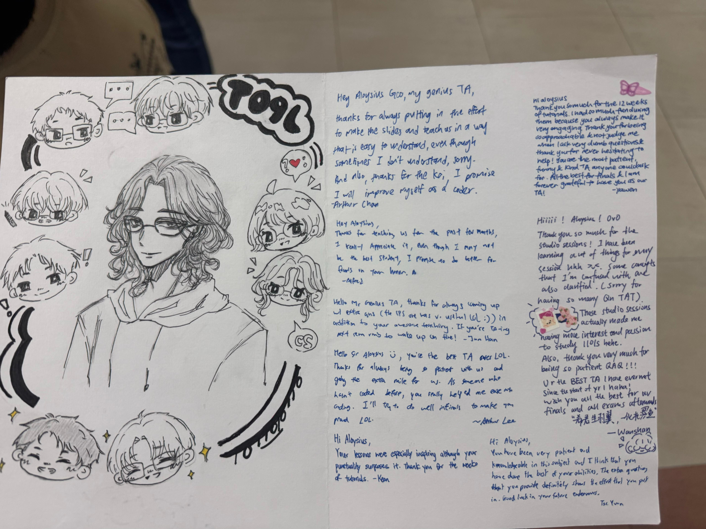

This semester, I was a part time Teaching Assistant for CS1101S, an introductory
module to programming that most Y1 students in NUS take as their first CS
module. I found the experience very fulfilling and I enjoyed teaching my small
class of 8 students every week. My billable hours every week included a 2 hour
teaching session as well as 2 hours allocated for preparation and grading, in
reality I probably spent 4 hours every week on preparation and grading.

## Preparation

My preparation for the weekly tutorials mainly involved me looking through the
lecture slides and creating a recap for the important topics introduced every
week. Given that most students taking this module would have done minimal
amounts of programming before, I made sure to approach my recaps with the
assumption that my students did not understand the lecture slides. This was
especially important for the later chapters, which introduced topics even I was
confused by when I first took the module.

Grading the students work usually took 1-2 hours a week. Up to week 10 the
missions and quests were pretty trivial to mark, given that I had already done
them the previous academic year. It mainly involved just spotting if their code
followed the specification in the question and handled edge cases. Past week 10,
it was more time consuming because I did not bother to do the same missions and
quest the previous year, so I had to figure out what the questions were asking
before marking their work. The questions were also more extensive and required
the students to write more code. With the added deadlines in the later weeks, I
went from grading their work once every 2-3 days to once a week.

Doing missions and quests awards students with XP that is used for a graded
component of the module. I mostly used my own discretion to decide how much XP
to deduct when encountering mistakes. In my view the amount of XP earned is not
too important, and I primarily used it to signal to students that they should
look through their solutions again and read my feedback.

## Teaching Tutorials

CS1101S is known to be a challenging module for beginner CS students, hence I
made sure to thoroughly recap the topics introduced every week. I try to
supplement my slides by drawing diagrams on the whiteboard, and direct questions
to the students to make them think about concepts further than what the lectures
introduced.

I found that simply teaching through slides was insufficient for the topics in
this module. Visual aids are a very powerful teaching tool, and I would often
include code snippets and related diagrams for each topic so that the students
can understand how theoretical ideas are represented in the program.

One important thing I had to keep in mind was to not overwhelm the students.
Occasionally, there would be related topics that I wanted to talk about but was
out of scope of the module, such topics may also overwhelm students who are not
able to grasp the underlying concepts in the first place. For these situations,
I would include an extra note in my slides simply mentioning the existence of
such topics, without diving into detail, so that interested students may look it
up on their own time.

For the tutorial questions, I would get students to present their own solutions
before going through my own solutions. This has the benefit of identifying
common mistakes students would make that I was not aware of, and providing other
students with multiple perspectives for how a problem can be solved. For some
questions, I would include multiple creative solutions to show my students in
the hopes that one of them will stick.

## Outside of tutorials

I tried to emphasise that I was always approachable outside of class for
students to hold consultation sessions with me, however most students did not
make use of my time. Looking back, I probably should have reached out to some of
the weaker students first and ask if they wanted consultation sessions.
Nonetheless there were still two students who I would hold consultations with
before every assessment, and I enjoyed helping them and hopefully it improved
their grades.

I also came up with my own preparation materials for students to do for each
assessment (except finals, I was too busy studying). I found it fun to put
myself in the shoes of a question setter and used it as an opportunity to
include challenging topics that I had held off from including in my weekly
tutorials.

## Final thoughts

I probably put in more effort than I was expected to as a TA for this module,
however I felt a sense of obligation given I signed up to tutor these students.
Beyond just teaching the module contents, I hope my students are motivated to
continue pursuing CS regardless of their final grade. To my students: I truly
appreciate the effort you have put in to this module, and your understanding
when I overslept twice and arrived half an hour late. I was really touched by
the thank you card you guys prepared before our last tutorial.

