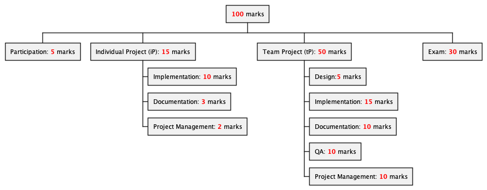

Prof: Damith Chatura Rajapakse

CS2103T teaches students software engineering practices, throughout this module,
students mainly work on 2 projects: 1 individual and 1 team based. This module
must be taken alongside
[CS2101](https://nusmods.com/courses/CS2101/effective-communication-for-computing-professionals),
which is a presentation module and also where you form your teams for the team
project in this module.

The theory in this module has a heavy focus on learning diagrams that
communicate software architecture and design, alongside effective design
principles, understanding user requirements, and test case design. The full
textbook can be read
[online here](https://nus-cs2103-ay2526s1.github.io/website/se-book-adapted/index.html).

The projects in this module also teaches students how to develop on a
medium-sized [JavaFX](https://openjfx.io/) application using Java 17. Throughout
the projects, students also learn how to build projects with
[Gradle](https://gradle.org/), use static analysis tools in IDEs, use dynamic
analysis tools like [Codecov](https://about.codecov.io/), CI with
[GitHub Actions](https://github.com/features/actions), and how to use GitHub,
including forking projects and making PRs.

Everything you need for the module is on
[the website](https://nus-cs2103-ay2526s1.github.io/website/), which made it
quite convenient. I would say the admin for this module is pretty well done, and
a lot of things are automated well. There are even
[dashboards](https://nus-cs2103-ay2526s1.github.io/dashboards/index.html) for us
to easily keep track of our progress for the projects which was very helpful.

Another graded component is the practical exam, where students have to find bugs
in other teams project, and submit accurate reports on at most 6 bugs in the
assigned project.

The teaching team also maintains [GitMastery](https://git-mastery.github.io/),
an app to teach students how to use Git, however I personally did not use this
app so I can not give any comments about it.

## Personal opinion

This is a decent module that is handled very well by the teaching team. Prof
Damith is clearly very passionate about teaching and responds very timely to
questions on the forums and emails, even past midnight. Students new to software
engineering are sure to learn a lot through the lectures and practical projects.

### Projects

As someone with experience in Java, JavaFX, and Git/GitHub, I did not find the
projects to be too challenging. The individual project was very hand-holdy, so
even students with little experience should be able to follow through. Beginner
programmers may struggle with the team project, as they are handed a ~6k LOC
codebase to start with, and there's heavy use of OOP (almost excessively)
throughout the codebase.

Personally, I disliked how the structure of the team project incentivizes you to
write less features, and to an extent even remove features from the app. The
reason being that less features = less bugs to be deducted, more features also
stretches the amount of time you can spend squashing bugs in your project.

### Theory

There is a weekly quiz you have to do that is mostly based on the theory gone
through in the lecture, but these quizzes do not change every semester so hit up
your seniors. I disliked the over-emphasis on UML diagrams which I don't believe
to be that prevalent in the industry. A big part of the assessments was on
spotting mistakes in UML diagrams, some of which are just minor notational
mistakes. Most of the other theory contents seem to be useful to new students.
Personally I did not read the theory for the whole semester up till the 2 days
leading up to the finals, the theory is really not hard at all, you just have to
memorise it.

### Practical Exam

I got lucky with the group I got assigned to because their project was riddled
with bugs, but if you are unlucky you can still point out feature flaws (where a
feature could have been implemented better with minimal effort) or documentation
bugs. I would advise groups to actually spend time polishing their user and
developer guide, as my team received a lot of reports nitpicking about things in
the documentation, which we were forced to accept.

### Overall

Overall this was a pretty chill mod where I didn't have to spend much time every
week working on. Most CS students will benefit from the practical components
where they gain experience on how to handle large software projects in a team
setting.

Workload: 5/10

Enjoyability: 6/10

Difficulty: 3/10

## Grade breakdown

| Assessment         | Marks   | LQ  | Med | UQ  |
| ------------------ | ------- | --- | --- | --- |
| Participation      | 5/5     | 5   | 5   | 5   |
| Individual Project | 15/15   | 15  | 15  | 15  |
| Team Project       | TBA/50  |     |     |     |
| Finals             | TBA/30  |     |     |     |
| Total              | TBA/100 |     |     |     |

Excepted grade: ¯\\\_(ツ)\\\_/¯ \
Final grade: TBA
